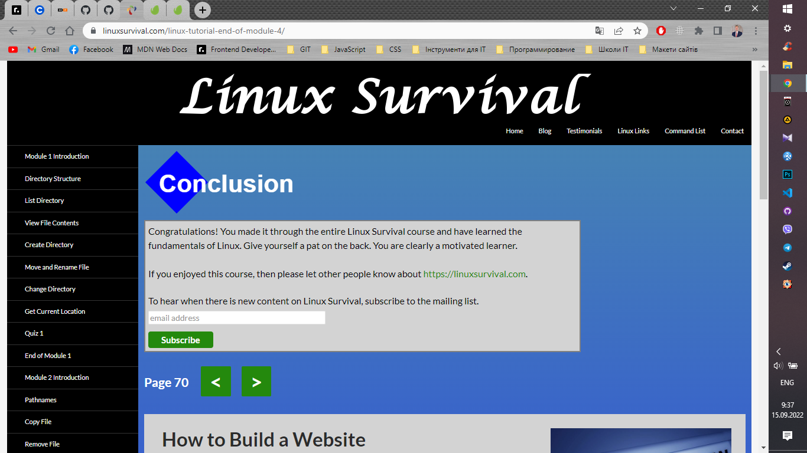

# kottans-frontend

## Git basics

Вітаю.

Враження від вивченого матеріалу:

Не думав, що VCS це настільки складна система, але при цьому неймовірно цікава та корисна в роботі. Я вражений. Попрактикувався в консолі, але мені поки що більш до душі GitHub Desktop з візуалізацією.

Дивився трохи на перед, в курсі ще будуть інші теми про Git. Деякі моменти його роботи мені ще не до кінця зрозумілі, + потрібна практика. Буду вчити. Планую почитати додаткової інформації та краще розібратися. Також, при роботі в команді з реальними проектами з часом думаю прийде розуміння.

Хочу висловити вашій команді подяку за курс. Планую пройти його як найшвидше, бо дуже хочу вчитися та стати Front-End розробником.

## Linux CLI, and HTTP

Що для вас було новим:
Майже вся інформація для мене була новою. Я новачок. З протоколом HTTP/HTTPS вже трохи був знайомий, завдяки лекціям CS50. Що стосується розділу Linux, то мені було відомо тільки про операційну систему та деякі окремі команди, які зустрічав самостійно вивчаючи Git.

Що вас здивувало:
При вивченні Linux Survival - кількість процесів, які виконуються ПК одночасно.
При вивченні HTTP/HTTPS - cookie, автентифікація та гешування.

Що ви плануєте використовувати в майбутньому:
Думаю, вся вивчена в цьому розділі інформація буде корисна в майбутньому. Можливо не все буде використовуватись в розробці, але для саморозвитку та розуміння процесів (які відбуваються між клієнтом і сервером) вивчене буде дуже корисним.
