# kottans-frontend

## Tasks

-   [x] [Git Basics](#git-basics)
-   [x] [Linux CLI, and HTTP](#linux-cli-and-http)
-   [x] [Git Collaboration](#git-collaboration)
-   [x] [Intro to HTML and CSS](#intro-to-html-and-css)
-   [x] [Responsive Web Design](#responsive-web-design)
-   [x] [HTML CSS Popup](#html-and-css-practice-hooli-style-popup)
-   [x] [JS Basics](#js-basics)
-   [ ] [DOM](#dom)
-   [ ] [Tiny JS World](#tiny-js-world)
-   [ ] [Object Oriented JS](#object-oriented-js)
-   [ ] [OOP Exercise](#oop-exercise)
-   [ ] [Offline Web Applications](#offline-web-applications)
-   [ ] [Memory Pair Game](#memory-pair-game)
-   [ ] [Website Performance Optimization](#website-performance-optimization)
-   [ ] [Friends App](#friends-app)

<!-- -------------------------------------------------------------------------------------------------------------------- -->

## Git basics

### Враження від вивченого матеріалу:

Не думав, що VCS це настільки складна система, але при цьому неймовірно цікава та корисна в роботі. Я вражений. Попрактикувався в консолі, але мені поки що більш до душі GitHub Desktop з візуалізацією.

Дивився трохи на перед, в курсі ще будуть інші теми про Git. Деякі моменти його роботи мені ще не до кінця зрозумілі, + потрібна практика. Буду вчити. Планую почитати додаткової інформації та краще розібратися. Також, при роботі в команді з реальними проектами з часом думаю прийде розуміння.

Хочу висловити вашій команді подяку за курс. Планую пройти його як найшвидше, бо дуже хочу вчитися та стати Front-End розробником.

<!-- -------------------------------------------------------------------------------------------------------------------- -->

## Linux CLI, and HTTP

### Що для мене було новим:

Майже вся інформація для мене була новою. Я новачок. З протоколом HTTP/HTTPS вже трохи був знайомий, завдяки лекціям CS50. Що стосується розділу Linux, то мені було відомо тільки про операційну систему та деякі окремі команди, які зустрічав самостійно вивчаючи Git.

### Що мене здивувало:

При вивченні Linux Survival - кількість процесів, які виконуються ПК одночасно.
При вивченні HTTP/HTTPS - cookie, автентифікація та гешування.

### Що планую використовувати в майбутньому:

Думаю, вся вивчена в цьому розділі інформація буде корисна в майбутньому. Можливо не все буде використовуватись в розробці, але для саморозвитку та розуміння процесів (які відбуваються між клієнтом і сервером) вивчене буде дуже корисним.

### Скріншоти виконаних завдань:

> 

>   
Linux tutorial end

> 
> 

<!--  -->

<!-- -------------------------------------------------------------------------------------------------------------------- -->

## Git Collaboration

### Що для мене було новим:

Нового багато. Це моє перше знайомство з Git та GitHub, тому близько 90% з вивченого матеріалу для мене є новим.

### Що мене здивувало:

Мене дивує, на скільки Git та GitHub зручна та корисна штука. Вони не прості, але містять дуже багато корисних функцій та можливостей для розробника та команди.

### Що планую використовувати в майбутньому:

Все, що вивчив. Вітки, форки, PR і багато-багато іншого. Весь вивчений матеріал корисний і з часом все більше з того, що на сьогодні опанував по Git та GitHub , буду використовувати в роботі.

### Мої міркування стосовно пройдених тем:

Як на мене, інформація зібрана чудова та все круто структуровано. Поетапно ти занурюєшся у все більш складні питання. Те, що є практичні моменти, допомагає краще засвоїти матеріал. Менше вилітає в інше вухо, як при вивченні голої теорії.

Особисто в мене, було бажання приділити більше часу практиці та спробувати всі можливі варіанти команд тощо. Також, ознайомився з деякими додатковими джерелами, що були надані. Це допомогло глибше зрозуміти деякі питання.
Як висновок, навчанням задоволений. Звичайно не все відклалося на 100%, але більшість інформації зрозумів і саме головне, що маю уявлення куди піти, якщо в майбутньому виникнуть труднощі.

### Скріншоти виконаних завдань:

<!-- -------------------------------------------------------------------------------------------------------------------- -->

## Intro to HTML and CSS

### Що для мене було новим:

Багато матеріалу для мене було знайомим, але ще більше я пізнав нових речей. Для прикладу: медіа запити, позиціонування, мета теги, псевдо класи та елементи, SCSS/SASS та багато іншого.

### Що мене здивувало:

Мене здував SCSS/SASS. Дуже гнучкий інструмент. Також, стали цікавим відкриттям медіа запити та широкі можливості CSS background.

### Що планую використовувати в майбутньому:

Дуже багато з нового вже починаю практикувати, щоб краще засвоїти. Особливу увагу хочу приділити позиціонуванню, SCSS/SASS, властивості CSS background, медіа запитам та деяким іншим новим речам. Все нереально цікаве, але потрібен час, щоб усе потроху перевести в практику та набити руку.

### Скріншоти виконаних завдань:

### Додаткова практика та виконані роботи:

Крім основних завдань курсу також виконав завдання для додаткові практики, що не входили до курсу. Приклади мого коду можна переглянути в папці мого репо: oleksii-anoshkin/kottans-frontend/task_html_css_intro/practice/...

<!-- -------------------------------------------------------------------------------------------------------------------- -->

## Responsive Web Design

### Що для мене було новим:

У flexbox для мене новим стало позиціонування та вирівнювання об'єктів. Про технологію Grid раніше чув, але не практикував. Вона здавалася мені складною, але на практиці все видалося значно простіше та цікавіше.

### Що мене здивувало:

Що використовуючи flexbox елементи можуть бути різної ширини/висоти. Також, що flexbox можна використовувати для розтягування елементів сайту не залежно від їх контенту.

### Що планую використовувати в майбутньому:

Flexbox дуже корисний та гнучкий. Grid також необхідна річ. Буду використовувати обидві технології за потреби.

### Скріншоти виконаних завдань:

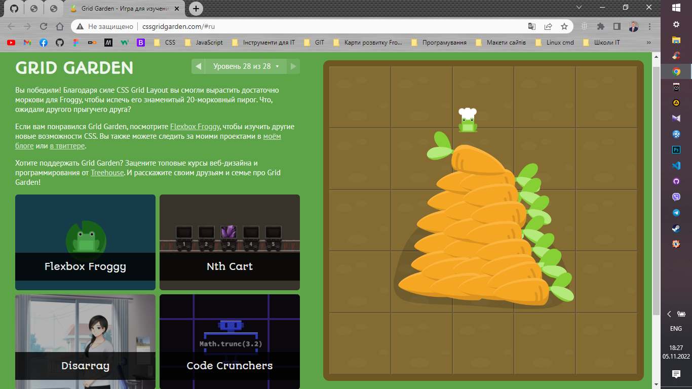
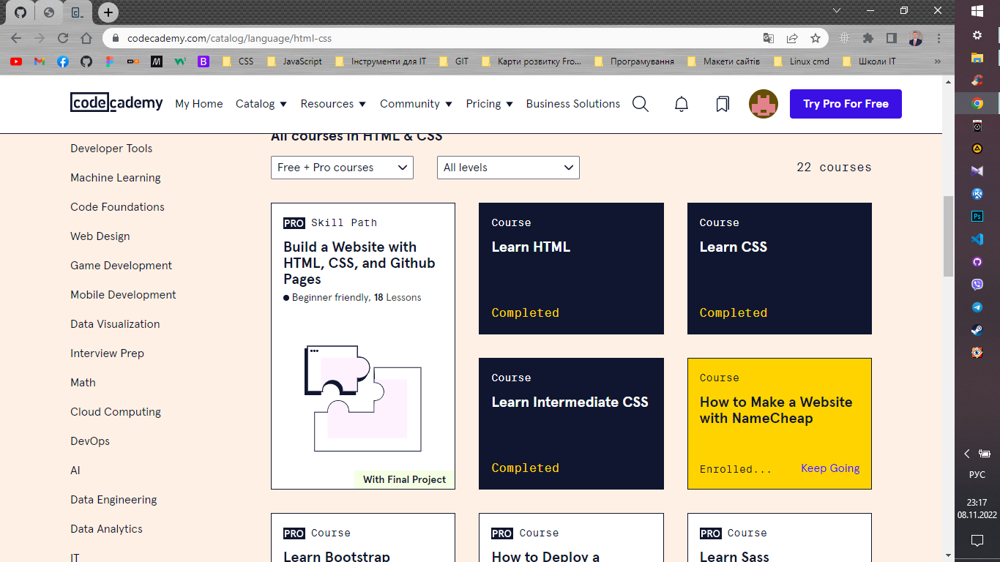
[Мій перший сайт](https://short-about-html.netlify.app "Що таке HTML?")
[Мій перший макет](https://britlex-lan9ua9e-school.netlify.app "Britlex Language School")

### Додаткова практика та виконані роботи:

Крім основних завдань курсу також виконав завдання для додаткові практики, що не входили до курсу. Приклади мого коду можна переглянути в папці мого репо: oleksii-anoshkin/kottans-frontend/task_responsive_web_design/...

<!-- -------------------------------------------------------------------------------------------------------------------- -->

## HTML and CSS practice: Hooli-style Popup

Виконане завдання цього розділу.
[Hooli-style Popup](https://html-css-popup.netlify.app "HTML CSS Popup Practise")

<!-- -------------------------------------------------------------------------------------------------------------------- -->

## JS Basics

### Що для мене було новим:

- Методи об'єктів та функцій.
- Що об'єкти та масиви можуть зберігати не тільки значення (числа, строки тощо), а й функції, методи тощо.
- Оператори /= та *=.
- Уникання закриття рядка та формування цитат за допомогою \".
- Доступ до масивів, що є елементами інших масивів.
- Default в switch.
- Видалення елементів об'єктів.
- Прототипи.
- Pекурсивні функції.
- Оператор "??".
- Класи, getter та setter.
- Обіцянки.
- Багато іншого...

### Що мене здивувало:

Pекурсивні функції - не думав, що функції можна використовувати в такому контексті. Також, мене здивувало гнучкість мови програмування JS та що для вирішення однієї задачі може бути багато способів.

### Що планую використовувати в майбутньому:

Всі знання, що отримав при вивченні даного розділу.

### Скріншоти виконаних завдань:

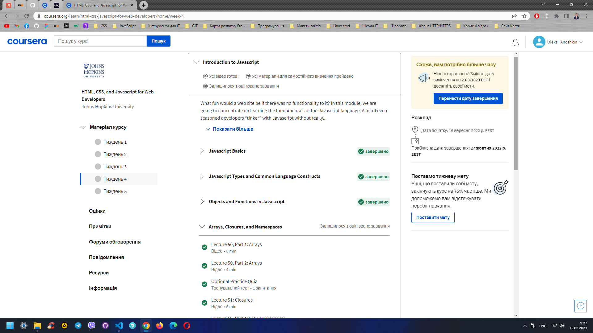
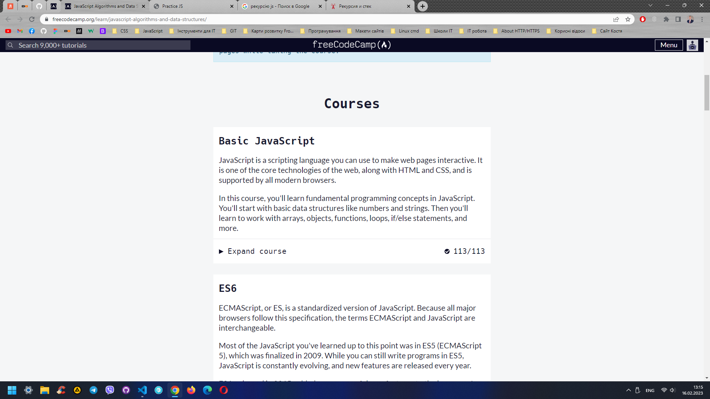
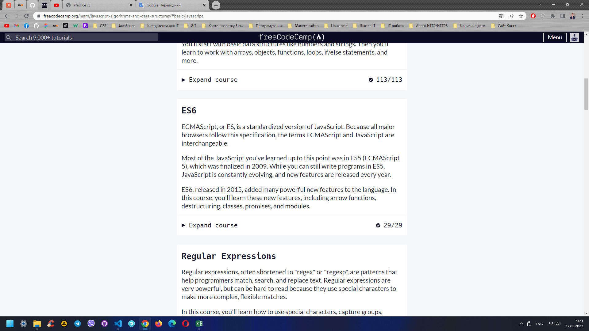
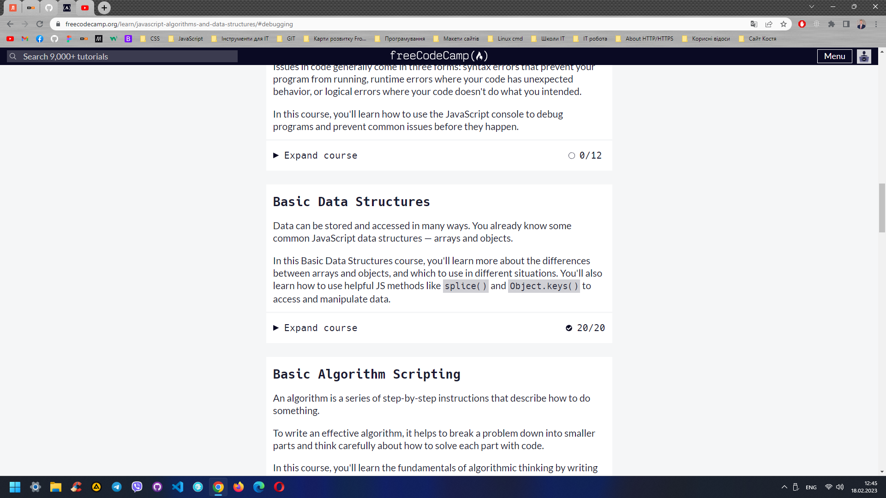
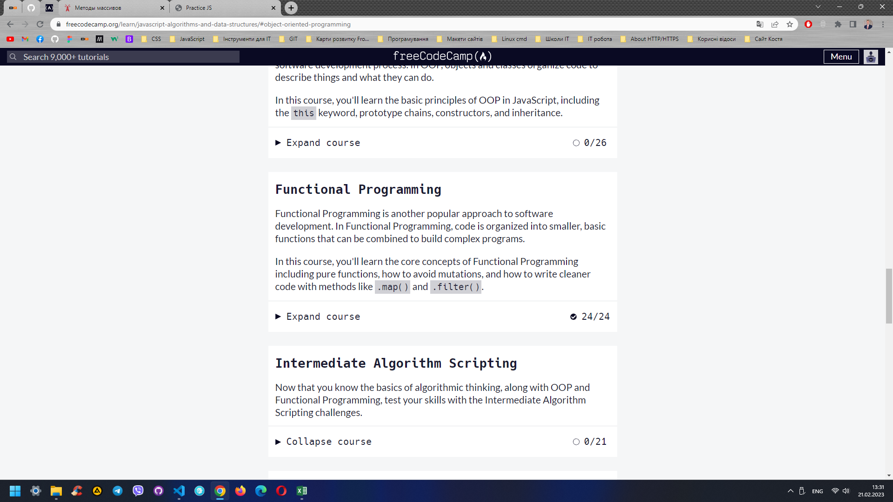
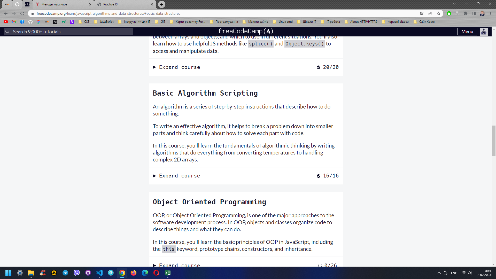
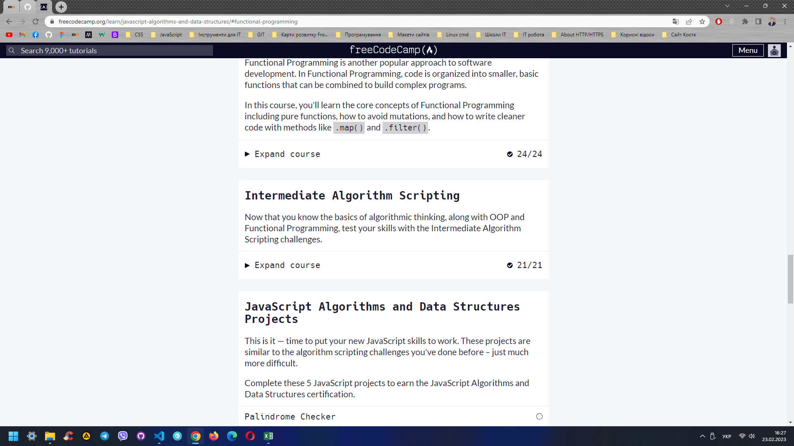

### Додаткова практика та виконані роботи:

[coursera-fullstack-week4-homework](https://github.com/oleksii-anoshkin/fullstack-course4/tree/master/assignments/assignment4/assignment4-solution-starter/harder "Week 4 homework")
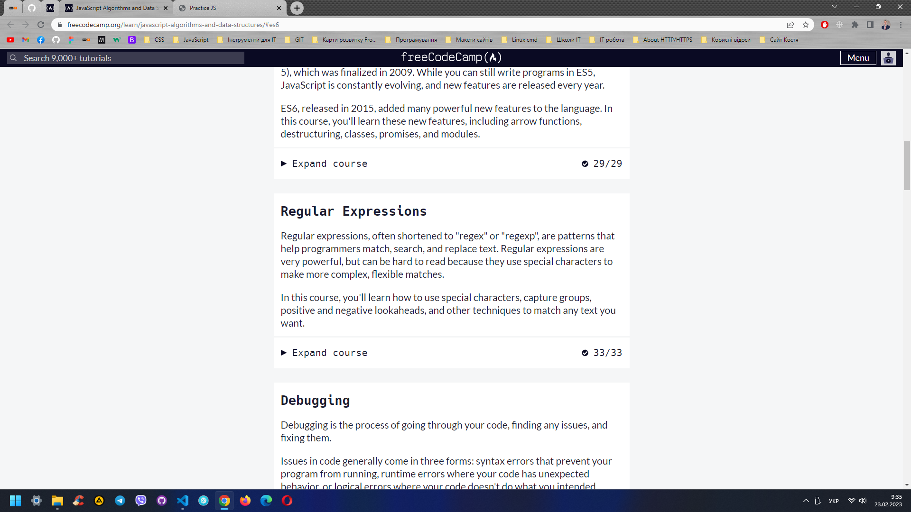
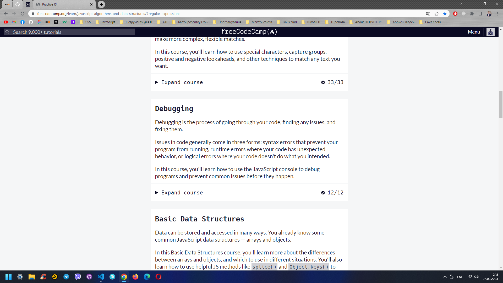
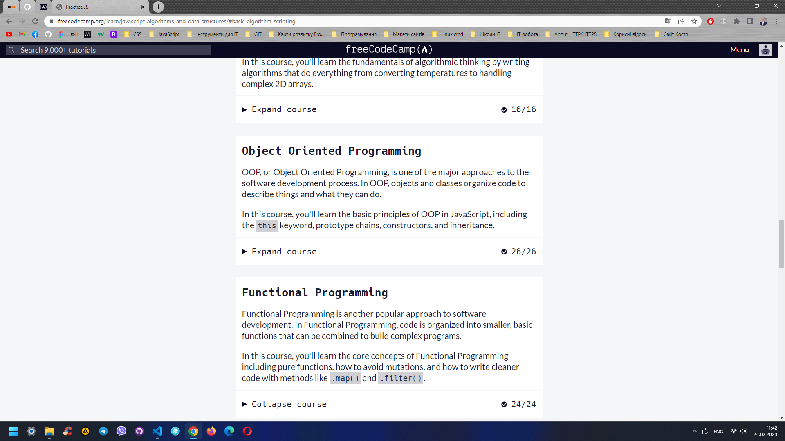
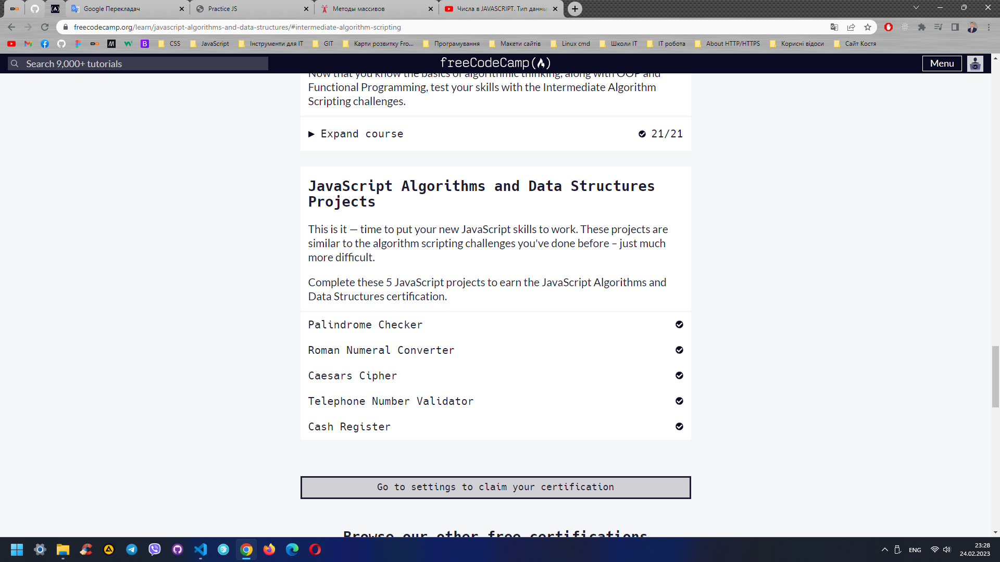

<!-- -------------------------------------------------------------------------------------------------------------------- -->
