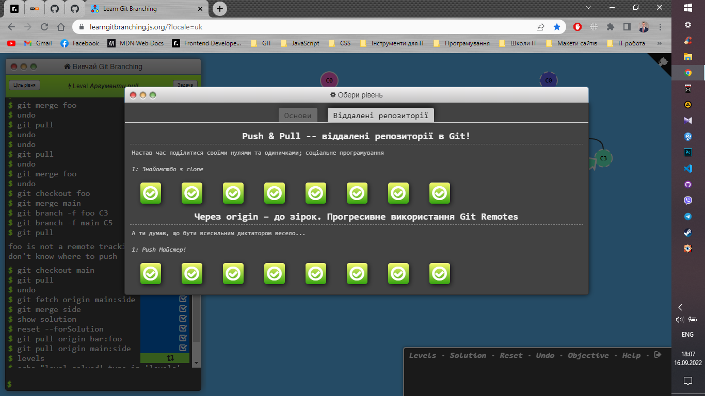
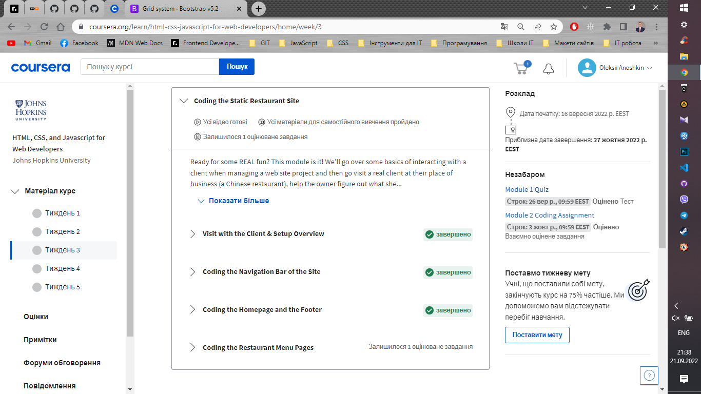

# kottans-frontend

## Git basics

### Враження від вивченого матеріалу:

Не думав, що VCS це настільки складна система, але при цьому неймовірно цікава та корисна в роботі. Я вражений. Попрактикувався в консолі, але мені поки що більш до душі GitHub Desktop з візуалізацією.

Дивився трохи на перед, в курсі ще будуть інші теми про Git. Деякі моменти його роботи мені ще не до кінця зрозумілі, + потрібна практика. Буду вчити. Планую почитати додаткової інформації та краще розібратися. Також, при роботі в команді з реальними проектами з часом думаю прийде розуміння.

Хочу висловити вашій команді подяку за курс. Планую пройти його як найшвидше, бо дуже хочу вчитися та стати Front-End розробником.

## Linux CLI, and HTTP

### Що для вас було новим:

Майже вся інформація для мене була новою. Я новачок. З протоколом HTTP/HTTPS вже трохи був знайомий, завдяки лекціям CS50. Що стосується розділу Linux, то мені було відомо тільки про операційну систему та деякі окремі команди, які зустрічав самостійно вивчаючи Git.

### Що вас здивувало:

При вивченні Linux Survival - кількість процесів, які виконуються ПК одночасно.
При вивченні HTTP/HTTPS - cookie, автентифікація та гешування.

### Що ви плануєте використовувати в майбутньому:

Думаю, вся вивчена в цьому розділі інформація буде корисна в майбутньому. Можливо не все буде використовуватись в розробці, але для саморозвитку та розуміння процесів (які відбуваються між клієнтом і сервером) вивчене буде дуже корисним.

### Скріншоти виконаних завдань:

## Git Collaboration

### Що для вас було новим:

Нового багато. Це моє перше знайомство з Git та GitHub, тому близько 90% з вивченого матеріалу для мене є новим.

### Що вас здивувало:

Мене дивує, на скільки Git та GitHub зручна та корисна штука. Вони не прості, але містять дуже багато корисних функцій та можливостей для розробника та команди.

### Що ви плануєте використовувати в майбутньому:

Все, що вивчив. Вітки, форки, PR і багато-багато іншого. Весь вивчений матеріал корисний і з часом все більше з того, що на сьогодні опанував по Git та GitHub , буду використовувати в роботі.

### Мої міркування стосовно пройдених тем:

Як на мене, інформація зібрана чудова та все круто структуровано. Поетапно ти занурюєшся у все більш складні питання. Те, що є практичні моменти, допомагає краще засвоїти матеріал. Менше вилітає в інше вухо, як при вивченні голої теорії.

Особисто в мене, було бажання приділити більше часу практиці та спробувати всі можливі варіанти команд тощо. Також, ознайомився з деякими додатковими джерелами, що були надані. Це допомогло глибше зрозуміти деякі питання.
Як висновок, навчанням задоволений. Звичайно не все відклалося на 100%, але більшість інформації зрозумів і саме головне, що маю уявлення куди піти, якщо в майбутньому виникнуть труднощі.

### Скріншоти виконаних завдань:

## Intro to HTML and CSS

### Що для вас було новим:

Багато матеріалу для мене було знайомим, але ще більше я пізнав нових речей. Для прикладу: медіа запити, позиціонування, мета теги, псевдо класи та елементи, SCSS/SASS та багато іншого.

### Що вас здивувало:

Мене здував SCSS/SASS. Дуже гнучкий інструмент. Також, стали цікавим відкриттям медіа запити та широкі можливості CSS background.

### Що ви плануєте використовувати в майбутньому:

Дуже багато з нового вже починаю практикувати, щоб краще засвоїти. Особливу увагу хочу приділити позиціонуванню, SCSS/SASS, властивості CSS background, медіа запитам та деяким іншим новим речам. Все нереально цікаве, але потрібен час, щоб усе потроху перевести в практику та набити руку.

### Скріншоти виконаних завдань:

### Додаткова практика та виконані роботи:

Крім основних завдань курсу також виконав завдання для додаткові практики, що не входили до курсу. Приклади мого коду можна переглянути в папці мого репо: oleksii-anoshkin/kottans-frontend/task_html_css_intro/practice/...

## Responsive Web Design

### Що для вас було новим:

У flexbox для мене новим стало позиціонування та вирівнювання об'єктів.

### Що вас здивувало:

Що використовуючи flexbox елементи можуть бути різної ширини/висоти. Також, що flexbox можна використовувати для розтягування елементів сайту не залежно від їх контенту.

### Що ви плануєте використовувати в майбутньому:

Flexbox дуже корисний та гнучкий. Буду використовувати по максимально.

### Скріншоти виконаних завдань:

[Мій перший сайт](https://short-about-html.netlify.app "Що таке HTML?")

### Додаткова практика та виконані роботи:

Крім основних завдань курсу також виконав завдання для додаткові практики, що не входили до курсу. Приклади мого коду можна переглянути в папці мого репо: oleksii-anoshkin/kottans-frontend/task_responsive_web_design/...